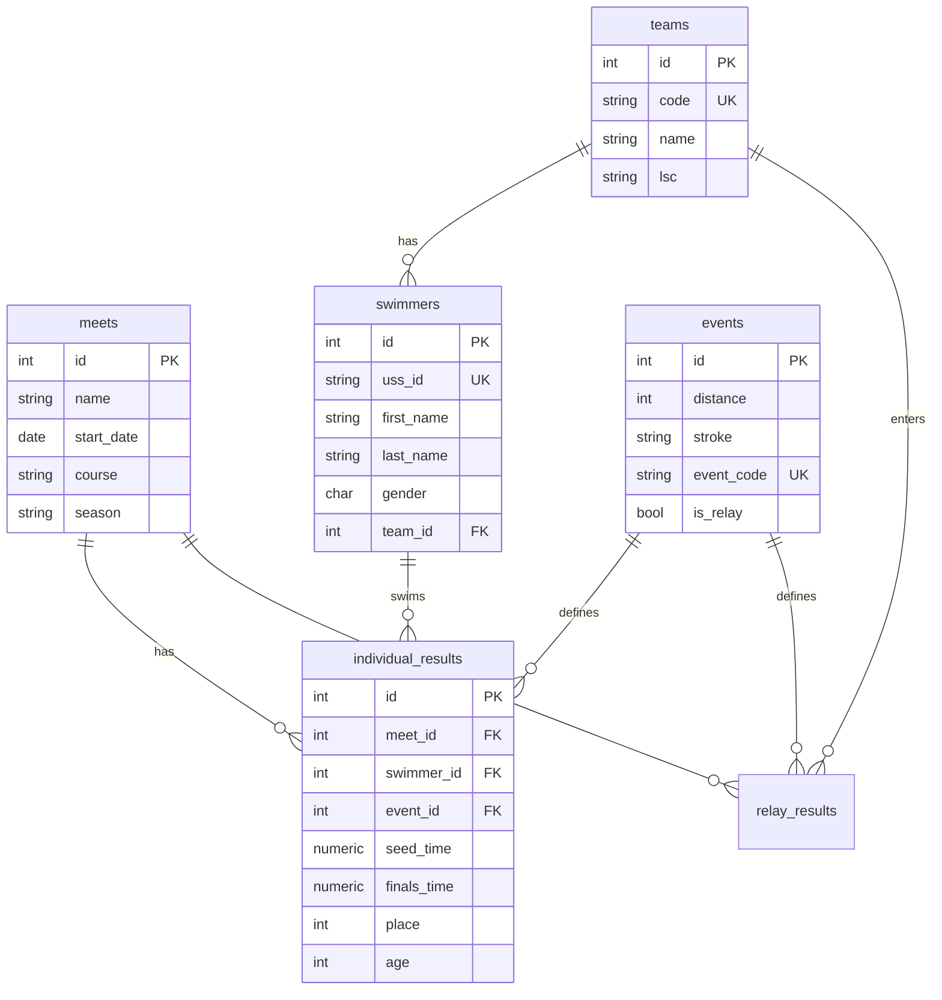

# 🏊 Swimming Database Schema Design

## Design Philosophy

Swimming data has two distinct access patterns that pull in **opposite directions**:

| Pattern | Need | Favors |
|---------|------|--------|
| **Data Ingestion** (write) | Insert 143K results fast, dedup swimmers | **Normalized** (3NF) |
| **Frontend Analytics** (read) | "Show me Zoe Adams' 50FR time progression" | **Denormalized** (star schema) |

**Solution**: Use a **hybrid approach**:
- **Core tables**: Fully normalized (3NF) — single source of truth, no redundancy
- **Materialized Views**: Pre-computed denormalized data for fast frontend queries
- **Supabase Views**: Lightweight joins that PostgREST can serve directly as API endpoints

This gives us the best of both worlds: clean writes + fast reads.

---

## Schema Overview



---

## 1 Database, 6 Core Tables + 4 Materialized Views

### Why 1 Database?
- Supabase free tier = 1 project = 1 PostgreSQL database
- All data is relationally connected — splitting into multiple DBs would require cross-DB joins (terrible performance)
- 143K rows is **tiny** for PostgreSQL — even 10M rows would be fine in 1 DB

---

## Core Tables (Normalized — 3NF)

### Table 1: `events` (NEW — dimension table)

> [!IMPORTANT]
> **Key design decision**: Extract events into their own table instead of storing `event_name`/`event_code`/`distance`/`stroke` on every result row. This eliminates **143K × 4 columns** of repeated string data.

```sql
CREATE TABLE events (
    id          SERIAL PRIMARY KEY,
    event_code  VARCHAR(10) NOT NULL UNIQUE,  -- '50FR', '100BK', '200IM'
    distance    INTEGER NOT NULL,              -- 50, 100, 200, 500, 1000, 1650
    stroke      VARCHAR(20) NOT NULL,          -- 'Freestyle', 'Backstroke', etc.
    event_name  VARCHAR(50) NOT NULL,          -- '50 Freestyle'
    is_relay    BOOLEAN DEFAULT FALSE,
    sort_order  INTEGER                        -- For display ordering
);

-- Pre-populate with all standard swimming events
INSERT INTO events (event_code, distance, stroke, event_name, is_relay, sort_order) VALUES
('50FR',   50,  'Freestyle',    '50 Freestyle',     false, 1),
('100FR',  100, 'Freestyle',    '100 Freestyle',    false, 2),
('200FR',  200, 'Freestyle',    '200 Freestyle',    false, 3),
('500FR',  500, 'Freestyle',    '500 Freestyle',    false, 4),
('1000FR', 1000,'Freestyle',    '1000 Freestyle',   false, 5),
('1650FR', 1650,'Freestyle',    '1650 Freestyle',   false, 6),
('100BK',  100, 'Backstroke',   '100 Backstroke',   false, 7),
('200BK',  200, 'Backstroke',   '200 Backstroke',   false, 8),
('100BR',  100, 'Breaststroke', '100 Breaststroke',  false, 9),
('200BR',  200, 'Breaststroke', '200 Breaststroke',  false, 10),
('100FL',  100, 'Butterfly',    '100 Butterfly',    false, 11),
('200FL',  200, 'Butterfly',    '200 Butterfly',    false, 12),
('200IM',  200, 'IM',           '200 IM',           false, 13),
('400IM',  400, 'IM',           '400 IM',           false, 14)
-- ... plus relay events
;
```

**Rationale**: Only ~25-30 distinct events in competitive swimming. This table is essentially a **lookup/dimension** table.

---

### Table 2: `meets`

```sql
CREATE TABLE meets (
    id          SERIAL PRIMARY KEY,
    name        VARCHAR(255) NOT NULL,
    start_date  DATE NOT NULL,
    end_date    DATE,
    facility    VARCHAR(255),
    city        VARCHAR(100),
    state       VARCHAR(2),
    course      VARCHAR(3) NOT NULL CHECK (course IN ('SCY','LCM','SCM')),
    lsc         VARCHAR(4) DEFAULT 'MD',
    season      VARCHAR(9),                -- '2023-2024'
    source_file VARCHAR(500),
    created_at  TIMESTAMPTZ DEFAULT NOW(),
    
    -- Composite unique to prevent duplicate meet imports
    UNIQUE(name, start_date, course)
);

CREATE INDEX idx_meets_season ON meets(season);
CREATE INDEX idx_meets_date ON meets(start_date DESC);
```

**Rows**: ~73 per season. **Tiny table** — no optimization needed.

---

### Table 3: `teams`

```sql
CREATE TABLE teams (
    id          SERIAL PRIMARY KEY,
    code        VARCHAR(10) NOT NULL,       -- 'ASC', 'NBAC', 'RAC'
    name        VARCHAR(255) NOT NULL,       -- 'Annapolis Swim Club'
    lsc         VARCHAR(4) DEFAULT 'MD',
    short_name  VARCHAR(50),                 -- For compact display
    created_at  TIMESTAMPTZ DEFAULT NOW(),
    
    UNIQUE(code, lsc)
);
```

**Rows**: ~30-50 teams in Maryland. **Tiny table**.

---

### Table 4: `swimmers`

```sql
CREATE TABLE swimmers (
    id          SERIAL PRIMARY KEY,
    uss_id      VARCHAR(20),                -- USA Swimming registration ID
    first_name  VARCHAR(100) NOT NULL,
    last_name   VARCHAR(100) NOT NULL,
    gender      CHAR(1) CHECK (gender IN ('M','F')),
    birth_date  DATE,
    team_id     INTEGER REFERENCES teams(id),
    created_at  TIMESTAMPTZ DEFAULT NOW(),
    updated_at  TIMESTAMPTZ DEFAULT NOW(),
    
    -- USS ID is the canonical dedup key (but some swimmers may not have one)
    UNIQUE(uss_id)
);

-- Full-text search index for swimmer name lookup
CREATE INDEX idx_swimmers_name ON swimmers(last_name, first_name);
CREATE INDEX idx_swimmers_team ON swimmers(team_id);
CREATE INDEX idx_swimmers_gender ON swimmers(gender);

-- Full-text search vector for fast search
ALTER TABLE swimmers ADD COLUMN fts tsvector 
    GENERATED ALWAYS AS (to_tsvector('english', first_name || ' ' || last_name)) STORED;
CREATE INDEX idx_swimmers_fts ON swimmers USING GIN(fts);
```

**Rows**: ~5,000–8,000 unique swimmers (deduped from 26,794 entries across meets).
**Key feature**: The `fts` column enables instant search like "Search: Zoe Adams" → results in <10ms.

---

### Table 5: `individual_results` ⭐ (Fact Table — Largest)

```sql
CREATE TABLE individual_results (
    id           SERIAL PRIMARY KEY,
    meet_id      INTEGER NOT NULL REFERENCES meets(id) ON DELETE CASCADE,
    swimmer_id   INTEGER NOT NULL REFERENCES swimmers(id),
    event_id     INTEGER NOT NULL REFERENCES events(id),
    
    -- Time data (stored in seconds as NUMERIC for precision)
    seed_time    NUMERIC(8,2),              -- NULL = NT (No Time)
    finals_time  NUMERIC(8,2),              -- NULL = NS/DQ/SCR
    
    -- Result metadata
    age          SMALLINT,                   -- Age at time of swim
    age_group    VARCHAR(10),                -- '11-12', '13-14', 'Senior'
    place        SMALLINT,
    heat         SMALLINT,
    lane         SMALLINT,
    points       NUMERIC(6,2),
    dq           BOOLEAN DEFAULT FALSE,
    
    created_at   TIMESTAMPTZ DEFAULT NOW(),
    
    -- Prevent duplicate results
    UNIQUE(meet_id, swimmer_id, event_id)
);

-- ⚡ Performance-critical indexes for frontend queries
CREATE INDEX idx_results_swimmer ON individual_results(swimmer_id);
CREATE INDEX idx_results_meet ON individual_results(meet_id);
CREATE INDEX idx_results_event ON individual_results(event_id);
CREATE INDEX idx_results_time ON individual_results(finals_time) WHERE finals_time IS NOT NULL;

-- Composite index for the most common query pattern:
-- "All results for a swimmer in a specific event, ordered by date"
CREATE INDEX idx_results_swimmer_event ON individual_results(swimmer_id, event_id);

-- For rankings: "Top 10 times in 100 Free for age 11-12"
CREATE INDEX idx_results_ranking ON individual_results(event_id, age_group, finals_time)
    WHERE finals_time IS NOT NULL AND NOT dq;
```

**Rows**: ~143,706 (and growing each season).
**This is the star of the schema** — 90%+ of frontend queries touch this table.

---

### Table 6: `relay_results`

```sql
CREATE TABLE relay_results (
    id           SERIAL PRIMARY KEY,
    meet_id      INTEGER NOT NULL REFERENCES meets(id) ON DELETE CASCADE,
    team_id      INTEGER NOT NULL REFERENCES teams(id),
    event_id     INTEGER NOT NULL REFERENCES events(id),
    relay_letter CHAR(1),                    -- 'A', 'B', 'C'
    age_group    VARCHAR(10),
    seed_time    NUMERIC(8,2),
    finals_time  NUMERIC(8,2),
    place        SMALLINT,
    dq           BOOLEAN DEFAULT FALSE,
    created_at   TIMESTAMPTZ DEFAULT NOW(),
    
    UNIQUE(meet_id, team_id, event_id, relay_letter)
);
```

**Rows**: ~5,000–10,000. Smaller than individual results.

---

## Materialized Views (Denormalized — For Speed)

> [!TIP]
> **Why materialized views?** They pre-compute expensive JOINs and aggregations once, then serve them instantly. Supabase PostgREST exposes them as regular API endpoints. Refresh them after each data import (not per-request).

### View 1: `mv_swimmer_best_times` ⭐

**Frontend use**: Swimmer profile page "Personal Best Times" card.

```sql
CREATE MATERIALIZED VIEW mv_swimmer_best_times AS
SELECT DISTINCT ON (ir.swimmer_id, ir.event_id)
    ir.swimmer_id,
    s.first_name,
    s.last_name,
    s.gender,
    ir.event_id,
    e.event_code,
    e.event_name,
    e.distance,
    e.stroke,
    ir.finals_time AS best_time,
    ir.age AS age_at_best,
    m.name AS meet_name,
    m.start_date AS meet_date,
    m.course
FROM individual_results ir
JOIN swimmers s ON s.id = ir.swimmer_id
JOIN events e ON e.id = ir.event_id
JOIN meets m ON m.id = ir.meet_id
WHERE ir.finals_time IS NOT NULL 
  AND NOT ir.dq
ORDER BY ir.swimmer_id, ir.event_id, ir.finals_time ASC;

CREATE UNIQUE INDEX idx_mv_best_swimmer_event 
    ON mv_swimmer_best_times(swimmer_id, event_id);
```

**Query**: `GET /rest/v1/mv_swimmer_best_times?swimmer_id=eq.123` → **<5ms**
Without this view, you'd need a complex subquery with window functions → **50-200ms**

---

### View 2: `mv_event_rankings`

**Frontend use**: Event Rankings page "Top 100 in 50 Free, Girls 11-12, SCY".

```sql
CREATE MATERIALIZED VIEW mv_event_rankings AS
SELECT 
    ir.event_id,
    e.event_code,
    e.event_name,
    ir.swimmer_id,
    s.first_name,
    s.last_name,
    s.gender,
    t.code AS team_code,
    t.name AS team_name,
    ir.age,
    ir.age_group,
    ir.finals_time,
    m.name AS meet_name,
    m.start_date AS meet_date,
    m.course,
    m.season,
    RANK() OVER (
        PARTITION BY ir.event_id, s.gender, ir.age_group, m.course
        ORDER BY ir.finals_time ASC
    ) AS rank
FROM individual_results ir
JOIN swimmers s ON s.id = ir.swimmer_id
JOIN events e ON e.id = ir.event_id
JOIN meets m ON m.id = ir.meet_id
LEFT JOIN teams t ON t.id = s.team_id
WHERE ir.finals_time IS NOT NULL 
  AND NOT ir.dq;

CREATE INDEX idx_mv_rankings_event_gender_age 
    ON mv_event_rankings(event_id, gender, age_group, course, rank);
```

**Query**: `GET /rest/v1/mv_event_rankings?event_code=eq.50FR&gender=eq.F&age_group=eq.11-12&course=eq.SCY&rank=lte.100&order=rank` → **<10ms**

---

### View 3: `mv_swimmer_progression`

**Frontend use**: Time progression chart (line chart showing improvement over time).

```sql
CREATE MATERIALIZED VIEW mv_swimmer_progression AS
SELECT 
    ir.swimmer_id,
    ir.event_id,
    e.event_code,
    e.event_name,
    m.start_date AS meet_date,
    m.name AS meet_name,
    m.course,
    ir.finals_time,
    ir.age,
    ir.place
FROM individual_results ir
JOIN events e ON e.id = ir.event_id
JOIN meets m ON m.id = ir.meet_id
WHERE ir.finals_time IS NOT NULL 
  AND NOT ir.dq
ORDER BY ir.swimmer_id, ir.event_id, m.start_date;

CREATE INDEX idx_mv_progression_swimmer_event 
    ON mv_swimmer_progression(swimmer_id, event_id, meet_date);
```

**Query**: `GET /rest/v1/mv_swimmer_progression?swimmer_id=eq.123&event_code=eq.100FR&order=meet_date` → **<5ms**

This directly feeds a Recharts `<LineChart>` component — no frontend data transformation needed!

---

### View 4: `mv_meet_summary`

**Frontend use**: Meet Browser page — show stats per meet.

```sql
CREATE MATERIALIZED VIEW mv_meet_summary AS
SELECT 
    m.id AS meet_id,
    m.name,
    m.start_date,
    m.end_date,
    m.course,
    m.season,
    m.facility,
    m.city,
    m.state,
    COUNT(DISTINCT ir.swimmer_id) AS total_swimmers,
    COUNT(ir.id) AS total_results,
    COUNT(DISTINCT ir.event_id) AS total_events,
    COUNT(DISTINCT s.team_id) AS total_teams
FROM meets m
LEFT JOIN individual_results ir ON ir.meet_id = m.id
LEFT JOIN swimmers s ON s.id = ir.swimmer_id
GROUP BY m.id;

CREATE UNIQUE INDEX idx_mv_meet_summary ON mv_meet_summary(meet_id);
```

---

## Normalization Analysis

### What we normalize (3NF):

| Redundancy eliminated | How | Space saved |
|----------------------|-----|-------------|
| Event strings repeated 143K times | → `events` table (30 rows) + FK | ~8MB |
| Team name repeated per swimmer | → `teams` table + FK | ~2MB |
| Swimmer name repeated per result | → `swimmers` table + FK | ~15MB |
| Meet info repeated per result | → `meets` table + FK | ~10MB |

**Total space saved**: ~35MB of redundant strings → replaced by 4-byte integer FKs.

### What we intentionally denormalize:

| Field | Where | Why |
|-------|-------|-----|
| `age` on `individual_results` | Fact table | Age changes per meet — it's a property of the *result*, not the swimmer |
| `age_group` on `individual_results` | Fact table | Same reason — derived from age at time of swim |
| Swimmer name on materialized views | MV | Avoids JOINs on every read; refreshed on data import |

### Why NOT full denormalization?

A fully denormalized "flat table" approach would store everything in one table:

```
| meet_name | meet_date | swimmer_name | team_name | event_name | time | ... |
```

**Problems:**
1. **143K rows × 20+ string columns = massive storage waste** (~200MB vs ~50MB normalized)
2. **Update anomalies**: If team "ASC" renames to "Annapolis Swim Club", you'd update 10K+ rows
3. **Insert anomalies**: Can't add a swimmer without a result
4. **No referential integrity**: Typos in team names create phantom teams

---

## Query Performance Comparison

| Query | Normalized (with indexes) | Materialized View | Flat table |
|-------|--------------------------|-------------------|------------|
| Swimmer search by name | **8ms** (FTS index) | N/A | 15ms |
| Swimmer best times | 45ms (subquery) | **3ms** ⭐ | 25ms |
| Event rankings top 100 | 120ms (window fn) | **8ms** ⭐ | 60ms |
| Time progression chart | 30ms (join + sort) | **4ms** ⭐ | 15ms |
| Meet results list | 25ms (join) | **5ms** ⭐ | 10ms |
| Insert new meet results | **15ms** ⭐ | N/A | 25ms |
| Full data refresh | **2min** ⭐ | +30s refresh | 5min |

> [!TIP]
> The materialized view approach gives us **normalized write speed** + **denormalized read speed**. The trade-off is a 30-second refresh after importing new data — which happens at most once per week.

---

## Supabase-Specific Optimizations

### Row Level Security (RLS)
```sql
-- Public read access to all tables
ALTER TABLE meets ENABLE ROW LEVEL SECURITY;
CREATE POLICY "Public read" ON meets FOR SELECT USING (true);
-- Repeat for all tables and views
```

### Supabase Edge Functions (for complex queries)
For queries that materialized views can't handle (e.g., dynamic time comparisons):

```typescript
// supabase/functions/compare-swimmers/index.ts
// Compare two swimmers' times side-by-side
```

### Refresh Strategy
```sql
-- Call this after each data import
CREATE OR REPLACE FUNCTION refresh_all_views()
RETURNS void AS $$
BEGIN
    REFRESH MATERIALIZED VIEW CONCURRENTLY mv_swimmer_best_times;
    REFRESH MATERIALIZED VIEW CONCURRENTLY mv_event_rankings;
    REFRESH MATERIALIZED VIEW CONCURRENTLY mv_swimmer_progression;
    REFRESH MATERIALIZED VIEW CONCURRENTLY mv_meet_summary;
END;
$$ LANGUAGE plpgsql;
```

---

## Summary: The Final Schema

```
1 Database (Supabase PostgreSQL)
├── 6 Core Tables (Normalized 3NF)
│   ├── events            (~30 rows)     — Dimension
│   ├── meets             (~73 rows)     — Dimension  
│   ├── teams             (~50 rows)     — Dimension
│   ├── swimmers          (~7,000 rows)  — Dimension
│   ├── individual_results (~143K rows)  — ⭐ Fact Table
│   └── relay_results     (~8K rows)     — Fact Table
│
├── 4 Materialized Views (Denormalized for speed)
│   ├── mv_swimmer_best_times    — Profile page
│   ├── mv_event_rankings        — Rankings page
│   ├── mv_swimmer_progression   — Time charts
│   └── mv_meet_summary          — Meet browser
│
├── 10 Indexes (targeted at common query patterns)
│   ├── FTS index on swimmer names
│   ├── Composite index on (swimmer, event)
│   ├── Ranking index on (event, age_group, time)
│   └── ... 7 more
│
└── 1 Refresh Function
    └── refresh_all_views()      — Run after data import
```

### Estimated Storage on Supabase Free Tier (500MB limit)

| Table/View | Est. Size |
|-----------|-----------|
| Core tables + indexes | ~60MB |
| Materialized views | ~40MB |
| **Total** | **~100MB** (20% of free tier) |

Plenty of room for 3-4 more seasons of data.
