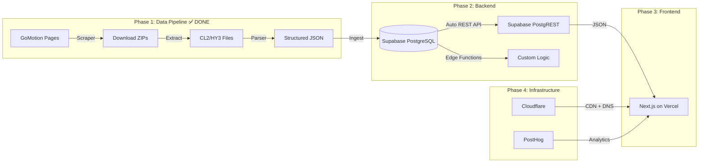

# 🏊 Swimming Database — Cloud App Implementation Plan

## Background & Goal

Build a cloud-hosted swimming database with **UI + Backend** that:
1. Scrapes meet result data from Maryland Swimming (LSC) GoMotion pages
2. Parses CL2/HY3 files from downloaded ZIP archives to extract structured results
3. Stores data in a relational database
4. Provides a modern web UI for searching swimmers, meets, and results
5. Is designed to scale to additional LSCs beyond Maryland

---

## User Review Required

> [!IMPORTANT]
> **Data Scraping Legality**: GoMotion/SportsEngine pages have no public API. We will download publicly-available ZIP files containing CL2/HY3 results. This is publicly posted data, but please confirm you're comfortable with automated downloads from their servers.

> [!WARNING]
> **CL2/HY3 Parsing Complexity**: These are proprietary Hy-Tek formats with no official spec. We'll leverage the open-source `hytek-parser` library (supports `.hy3`) and build a custom CL2 parser based on reverse-engineered SDIF specs. Parsing accuracy will need manual spot-checking against PDF results.

> [!IMPORTANT]
> **Cloud Cost**: The recommended stack (Supabase free tier or Railway) should cost **$0/month** for the pilot phase. If you need a production-grade deployment, costs will be ~$10-25/month. Please confirm your budget preference.

---

## Open Questions

> [!IMPORTANT]
> 1. **Hosting preference**: Do you prefer a free-tier platform (Supabase + Vercel) or a paid but simpler platform (Railway, Render)?
> 2. **Scope of "one state"**: Maryland Swimming (MDSI) covers 21 counties. The 2023-2024 season page shows ~70+ meets. Should we scrape ALL meets or start with a subset (e.g., championship meets only)?
> 3. **User authentication**: Does the app need user login/accounts, or is it a public read-only database?
> 4. **Historical data**: The 2025-2026 page URL was provided but appears to be the same as 2023-2024. Do you have the correct 2025-2026 URL, or should we focus on 2023-2024 first?
> 5. **Data update frequency**: One-time import, or should the scraper run on a schedule (e.g., weekly cron)?

---

## Architecture Overview



---

## Technology Stack (Updated)

| Layer | Technology | Rationale |
|-------|-----------|-----------|
| **Scraper** | Python + `requests` + `BeautifulSoup4` | ✅ Done — best for HTML parsing & file downloads |
| **File Parser** | Python custom CL2 parser | ✅ Done — reverse-engineered from actual Hy-Tek files |
| **Database** | **Supabase** (managed PostgreSQL) | Free tier: 500MB DB, auto-generated REST API, built-in Auth |
| **Backend API** | **Supabase PostgREST** + Edge Functions | No need for custom FastAPI — Supabase auto-generates REST from tables |
| **Frontend** | **Next.js** on **Vercel** | SSR for SEO, great DX, seamless Vercel integration |
| **CDN** | **Cloudflare** | DNS, CDN caching, DDoS protection, free tier |
| **Analytics** | **PostHog** | User behavior, feature flags, session replay, free tier 1M events/mo |

---

## Proposed Changes — 5 Phases

---

### Phase 1: Data Scraping & Download — ✅ COMPLETE

**Actual Results:**
- 🟢 73 meets scraped from Maryland Swimming 2023-2024 season
- 🟢 73/73 ZIP files downloaded (0 failures)
- 🟢 146 data files extracted (CL2 + HY3 per meet)
- 🟢 Files stored in `data/raw/2023_2024/{meet_name}/`

---

### Phase 2: CL2/HY3 File Parsing — ✅ CORE COMPLETE

**Actual Results:**
- 🟢 72/73 meets parsed successfully (0 errors)
- 🟢 26,794 swimmer entries (with duplicates across meets)
- 🟢 **143,706 individual results** extracted
- 🟢 Output: `data/parsed/all_meets_2023_2024.json`

**Remaining:**
- ⬜ Refine C1 team record parsing (currently under-counting teams)
- ⬜ Spot-check 5 meets against PDF results for accuracy validation

---

### Phase 3: Supabase Database & API (~2-3 days)

> Using Supabase eliminates the need for a custom FastAPI backend.
> Supabase auto-generates a REST API (PostgREST) from your PostgreSQL tables.

#### Step 1: Create Supabase Project
- Create free project at supabase.com
- Get connection string, API keys

#### Step 2: Create Schema via Supabase SQL Editor
- Same schema as before (meets, teams, swimmers, individual_results, relay_results)
- Add Row Level Security (RLS) policies for public read access

#### Step 3: Data Ingestion Script
- Python script to read `all_meets_2023_2024.json`
- Insert into Supabase PostgreSQL via `supabase-py` client
- Dedup swimmers by USS ID
- ~143,706 results to insert

#### Auto-Generated API (free from Supabase)
- `GET /rest/v1/meets` — with filtering, pagination, ordering
- `GET /rest/v1/swimmers?last_name=eq.Smith` — powerful query syntax
- `GET /rest/v1/individual_results?swimmer_id=eq.123` — joins supported
- Full-text search via PostgreSQL `tsvector`

---

### Phase 4: Next.js Frontend on Vercel (~5-6 days)

Same UI pages as before, but using `@supabase/supabase-js` client directly:

| Page | Features |
|------|----------|
| **Home / Dashboard** | Season overview, recent meets, top performers, quick search |
| **Meet Browser** | List of all meets, filter by date/season/course |
| **Meet Detail** | All events & results for a meet, sortable tables |
| **Swimmer Search** | Search by name, team, age group; autocomplete |
| **Swimmer Profile** | Personal bests, all results, time progression charts |
| **Team Page** | Team roster, team results |
| **Event Rankings** | Top times by event, age group, season |

**Design:**
- Dark mode with swimming-themed color palette (deep blue gradients, teal accents)
- Glassmorphism cards, smooth animations
- Mobile responsive (parents checking results at meets)
- Charts via Recharts
- PostHog integration for analytics

---

### Phase 5: Infrastructure & Verification (~2-3 days)

#### Deployment Architecture
```
Cloudflare (DNS + CDN) → Vercel (Next.js Frontend) → Supabase (PostgreSQL + API)
                                                    → PostHog (Analytics)
```

#### Data Verification Strategy

| Check | Method | Target |
|-------|--------|--------|
| **Parse accuracy** | Compare 5 meets' parsed data vs PDF results manually | 99%+ match |
| **Record counts** | Compare total swimmers/results per meet vs source file line counts | Exact match |
| **Time validation** | Flag any time < 5s or > 3600s (likely parse errors) | 0 false positives |
| **Duplicate detection** | Same swimmer + same event + same meet = 1 result | No duplicates |
| **API latency** | Measure p50/p95 response times | p95 < 200ms |
| **Search latency** | Full-text swimmer search | < 500ms |
| **End-to-end** | Scrape → Parse → Ingest → Query → Display in UI | Complete chain works |

#### Automated Tests
```bash
# Parser unit tests — verify against known CL2/HY3 sample files
pytest tests/parser/ -v

# API integration tests
pytest tests/api/ -v

# Spot-check: compare parsed results vs PDF for random meets
python scripts/verify_against_pdf.py --meet-id 5 --meets 3
```

---

## Timeline Summary

| Phase | Description | Estimated Time | Status |
|-------|-------------|---------------|--------|
| **1** | Scraper + Download | 3-4 days | ✅ DONE |
| **2** | CL2/HY3 Parser | 5-7 days | ✅ CORE DONE |
| **3** | Supabase DB + Ingest | 2-3 days | ⬜ Next |
| **4** | Next.js Frontend | 5-6 days | ⬜ |
| **5** | Cloudflare + PostHog + Verify | 2-3 days | ⬜ |
| | **Total** | **17-23 days** | |

> [!NOTE]
> Times assume part-time work (~3-4 hrs/day). With full-time focus, this could be compressed to **10-14 days**. Phase 2 (parsing) is the highest-risk phase and may take longer if CL2 files have unexpected formatting.

---

## TODO List (High-Level)

```
Phase 1: Scraping
- [ ] Build meet list scraper for MD 2023-2024
- [ ] Build ZIP file downloader with retry logic
- [ ] Download & catalog all result files

Phase 2: Parsing  
- [ ] Set up hytek-parser for HY3 files
- [ ] Build custom CL2 fixed-width parser
- [ ] Create Pydantic data models
- [ ] Parse all downloaded files → JSON
- [ ] Spot-check 5 meets against PDF results

Phase 3: Backend
- [ ] Design & create PostgreSQL schema
- [ ] Build FastAPI REST API
- [ ] Build data ingestion script
- [ ] Write API integration tests

Phase 4: Frontend
- [ ] Set up Vite + React project
- [ ] Build Meet Browser page
- [ ] Build Swimmer Search + Profile pages
- [ ] Build Event Rankings page
- [ ] Add time progression charts
- [ ] Mobile responsive design

Phase 5: Deploy & Verify
- [ ] Deploy backend to Railway/Render
- [ ] Deploy frontend to Vercel
- [ ] Run full verification suite
- [ ] Measure and optimize latency
```

---

## Risk Register

| Risk | Impact | Mitigation |
|------|--------|------------|
| CL2/HY3 format varies between Meet Manager versions | High | Test with multiple file samples; log and skip unparseable records |
| GoMotion changes URL structure or blocks scraping | Medium | Cache all downloaded files locally; implement scraper error handling |
| `hytek-parser` doesn't support all record types we need | Medium | Fork the library and add support, or fall back to custom parser |
| Some meets only have PDF results (no ZIP) | Low | Phase 2+ could add OCR as a fallback, but skip for MVP |
| Free tier DB runs out of storage | Low | Start with most recent 2 seasons; archive raw files separately |

---

## Data Harvest Results (Actual)

| Metric | Value |
|--------|-------|
| **Meets scraped** | 73 (2023-2024 MD season) |
| **ZIP files downloaded** | 73/73 (0 failures) |
| **CL2 + HY3 files** | 146 total |
| **Meets parsed** | 72 (0 errors) |
| **Swimmer entries** | 26,794 (with duplicates) |
| **Individual results** | **143,706** |
| **Data location** | `data/parsed/all_meets_2023_2024.json` |
